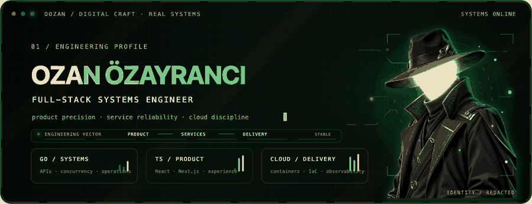

<p align="center">
  
</p>

<p align="center">
  <a href="https://www.linkedin.com/in/oozan/"></a>
  <a href="mailto:oozyranci@gmail.com"></a>
  <a href="https://github.com/oozan?tab=repositories"></a>
</p>

## Engineering products that endure

I’m **Ozan Özayrancı**, a full-stack developer focused on systems that are fast at the interface, predictable in production, and understandable by the next engineer who touches them.

My background as a former professional drummer and volleyball coach still shapes the way I build software: keep the rhythm, communicate early, practise the fundamentals, and make the whole team better. I move comfortably between product UI, backend services, data modelling, security boundaries, and cloud delivery.

```text
product experience  →  service boundaries  →  reliable data  →  observable delivery
```

## Current direction

- Building production-oriented services in **Go**, with clear APIs, concurrency-aware design, and operational safeguards.
- Creating accessible product experiences with **TypeScript, React, and Next.js**.
- Strengthening delivery through **containers, Kubernetes, Terraform, Azure, and AWS**.
- Exploring practical AI automation where it removes repetitive work instead of adding novelty.

## Technology map

| Layer | Tools I work with |
| --- | --- |
| **Product** | TypeScript · React · Next.js · Tailwind CSS · Redux Toolkit · accessible component systems |
| **Services** | Go · Node.js · NestJS · Python · FastAPI · REST · WebSocket · MQTT |
| **Data** | PostgreSQL · MySQL · Cosmos DB · Redis · SQL repository patterns |
| **Delivery** | Docker · Kubernetes · Terraform · GitHub Actions · Azure · AWS · Vercel |
| **Engineering** | API design · automated testing · observability · performance · application security |

<p>
  
  
  
  
  
  
  
  
  
  
  
  
</p>

## Selected systems

<table>
  <tr>
    <td width="50%" valign="top">
      <h3><a href="https://github.com/oozan/chat-neatve">Whisper</a></h3>
      <p>A responsive messaging product that encrypts message bodies in the browser with AES-256-GCM before persisting ciphertext to Cloudflare D1. Includes durable conversations, offline recovery, encrypted replies and reactions, local drafts, search, and accessibility controls.</p>
      <code>TypeScript</code> <code>React</code> <code>Web Crypto</code> <code>Cloudflare D1</code>
    </td>
    <td width="50%" valign="top">
      <h3><a href="https://github.com/oozan/streetlights-finland">Streetlights Finland</a></h3>
      <p>A sanitized operational backend for devices, alarms, schedules, and system events. It combines REST APIs, WebSocket updates, MQTT messaging, scheduled workflows, and dual relational databases in a locally reproducible Go service.</p>
      <code>Go</code> <code>MySQL</code> <code>MQTT</code> <code>WebSocket</code>
    </td>
  </tr>
  <tr>
    <td width="50%" valign="top">
      <h3><a href="https://github.com/oozan/astraeus-control-plane">Astraeus Control Plane</a></h3>
      <p>A cloud-native asynchronous processing platform with API and worker services, durable job state, queue coordination, private networking, infrastructure as code, observability, deployment gates, and cost controls.</p>
      <code>FastAPI</code> <code>PostgreSQL</code> <code>Redis</code> <code>Terraform</code> <code>AWS</code>
    </td>
    <td width="50%" valign="top">
      <h3><a href="https://github.com/oozan/insecure-webapp-owasp">OWASP Security Lab</a></h3>
      <p>An intentionally vulnerable Django application that demonstrates five OWASP Top 10 flaws—including injection, broken access control, security misconfiguration, and SSRF—with adjacent remediation examples for study and comparison.</p>
      <code>Python</code> <code>Django</code> <code>OWASP</code> <code>AppSec</code>
    </td>
  </tr>
</table>

## How I approach the work

1. **Clarify the real constraint.** Performance, delivery speed, security, and maintainability need explicit trade-offs.
2. **Design the boundary before the implementation.** Small interfaces and clear ownership prevent accidental complexity.
3. **Make failure visible.** Tests, logs, health checks, metrics, and runbooks belong to the product—not an afterthought.
4. **Leave the system easier to change.** Clean code matters most when requirements move and another person must continue the work.

---

<p align="center">
  <strong>Open to thoughtful engineering conversations and product-focused collaboration.</strong><br />
  <a href="mailto:oozyranci@gmail.com">oozyranci@gmail.com</a> · <a href="https://www.linkedin.com/in/oozan/">LinkedIn</a>
</p>
